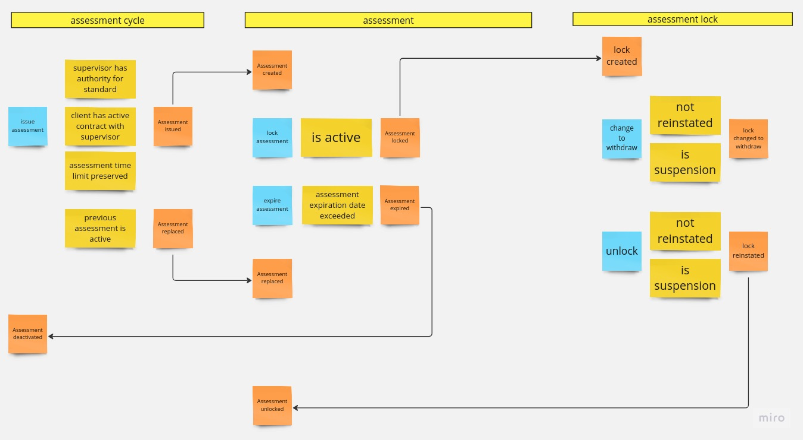

# Recruitment assignment

The task is to implement the business domain logic associated with the evaluation process based on the description below.

**It is not required to finish the task. The main purpose of it is to demonstrate programming and modeling skills.**

It is required to prepare a set of automated tests (PHPUnit) to verify the correctness of the implementation in accordance with business requirements.

Tests must be runnable and green.

## Consider following requirements

1. The system allows the recording of assessments carried out with their evaluations.
1. The assessment is carried out by the Supervisor.
1. The assessment is carried out offline during an on-site audit.
1. Assessment is carried out in the indicated Standard.
1. Clients can have multiple assessments in different standards.
1. The Client being evaluated must have an active contract with the Supervisor.
1. The Supervisor must have authority for the standard.
1. Upon completion of evaluation the assessment can have positive or negative ratings.
1. The assessment has an expiration date of 365 days counting from the day evaluation took place. After it is exceeded, the assessment expires.
1. Subsequent assessments in the same standard may be conducted after a period of not less than 180 days for evaluation completed with a positive result and 30 days for evaluation completed with a negative result.
1. Subsequent assessment replaces the current one in the same standard if it was active on the day of an audit.
1. It is possible to lock the assessment by suspension or withdrawn.
1. Suspended assessment can be unlocked.
1. Suspended assessment may be withdrawn.
1. Withdrawn assessment cannot be unlocked nor withdrawn cannot be changed into suspension.
1. Expired assessment cannot be locked.
1. When assessment is expired or replaced it will be considered inactive.
1. It is not possible to lock an assessment that is currently locked, it is necessary to unlock it in advance. Only changing Suspension into withdrawn is allowed.

## Approaching the task

Let's assume that this description exceeds business requirements.

Best way to start is to visualize how described business may behave. However, before that we need to understand what happens in the system. Let's ask following questions:

**Q: What impact does evaluation rating have on issuing subsequent Assessments or its management?**

A: Evaluation rating doesn't have any impact on single Assessment management. Therefore, Assessment doesn't need to know its evaluation. For issuing subsequent Assessments, evaluation of previous one modifies time limit which must be preserved between each Assessments. 

**Q: Should Assessment know about and track contracts between Client and Supervisor?**

A: No. This is not its scope. Those contracts change in their own context. This is part of a policy which should be injected into Assessment Issuing process.

**Q: Should Assessment know about and track Supervisors authority for given Standard?**

A: No. Supervisor authority changes independently of Assessments. This is part of a policy which should be injected into Assessment Issuing process.

**Q: Does Assessment management (locking, unlocking, expiration) have impact on issuing subsequent Assessments?**

A: No. There is no rule saying that expired or locked Assessment has any impact on Assessment Issuing process. Only that we won't replace inactive Assessment which was expired on already replaced. Those operations can be aggregated in Assessment object.

**Q: Should Assessment know about and track previously issued Assessments?**

A: It may, but this information is only required for issuing new Assessment. Assessment object could create subsequent Assessments however, those must have the same standard. If Supervisor tries to issue an Assessment for different standard, process should still succeed therefore, Assessment must have knowledge about Assessments in other standards. Also, issuing Assessment and its management are not common. We should see this is already too much for Assessment to handle.

**Q: When locked Assessment expires, can it still be unlocked?**

A: Yes. There is no limitation regarding lock reinstate.

Asking questions like that during Event Storming sessions we can come up with design similar to one shown below. Make notice there were similar questions asked about relation between Assessment and its lock management which leads to separating Assessment Lock from Assessment itself.

Assessment Cycle is responsible for issuing new Assessments. It is identified by combination of Client and Standard in which Assessments can be created. Therefore, issuing an Assessment will be done in specific Assessment Cycle which keeps track of any subsequent Assessments.

Assessment is responsible for management of single Assessment.

Assessment Lock aggregates logic that exceeds Assessment management.

## Implementation

Implementation is based directly on design after Event Storming session. It uses Ecotone Framework which allows to make use of Event Sourcing and Message-Driven approach. 

Ecotone requires only to add attributes which define and connect building blocks, like Aggregates, Events, Commands.

## TODO

1. Implement Assessment Locking.
2. When issuing subsequent Assessment, last assessment will always be replaced even if it is inactive.
